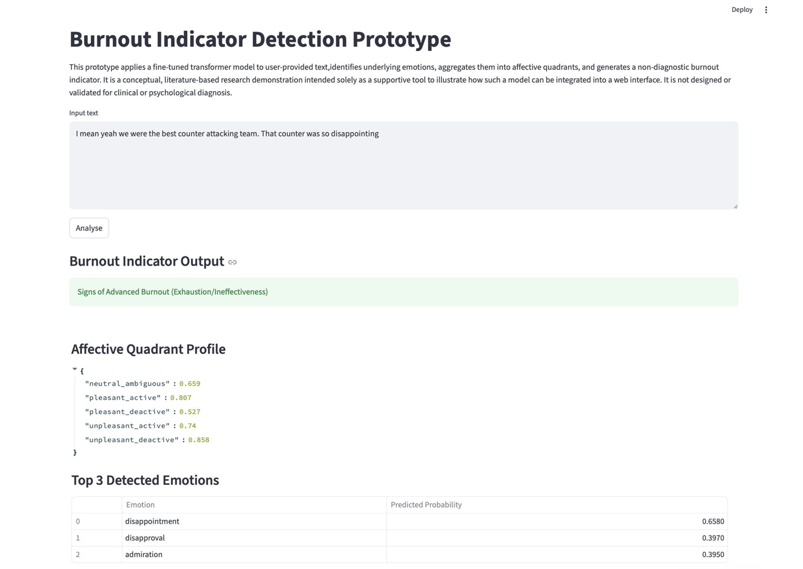
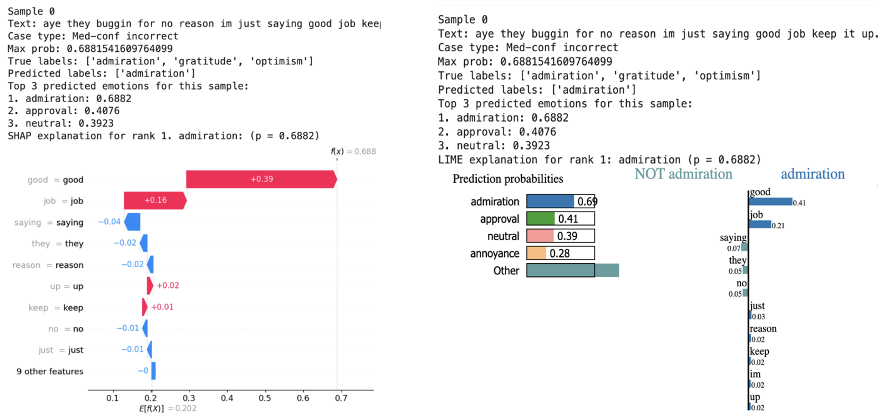
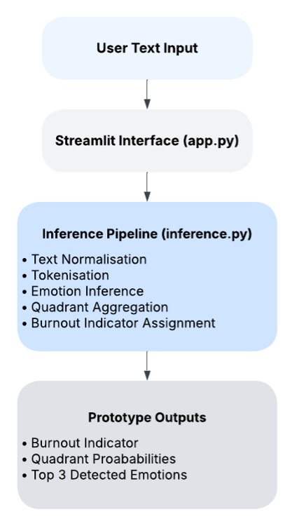

# Emotion Analytics Burnout Indicators NLP

## Project Overview

This project develops an emotion-aware NLP framework for identifying **non-diagnostic burnout-related indicators** from text. The system uses transformer-based multi-label emotion classification and maps predicted emotions into broader affective categories using a literature-informed valence-arousal framework.

The project is based on the **GoEmotions dataset** and includes exploratory data analysis, preprocessing, baseline modelling, transformer fine-tuning, quadrant-level emotion aggregation, burnout indicator mapping, and a lightweight Streamlit prototype.

The system is designed for academic and technical demonstration only. It does **not** diagnose burnout or mental health conditions.

---

## Prototype Preview



The prototype allows users to enter free text and returns:

- A burnout-related indicator
- Quadrant-level probability scores
- Top predicted emotions ranked by confidence

---

## Project Pipeline

The project follows an end-to-end NLP pipeline:

```text
Raw GoEmotions Dataset
        ↓
Exploratory Data Analysis
        ↓
Text Cleaning and Preprocessing
        ↓
Baseline Model Training
        ↓
Transformer Fine-Tuning
        ↓
Emotion-Level Prediction
        ↓
Valence-Arousal Quadrant Aggregation
        ↓
Rule-Based Burnout Indicator Mapping
        ↓
Streamlit Prototype
```
1. Emotion Detection
Fine-grained emotions are predicted from text using multi-label classification.

2. Valence-Arousal Categorisation
Predicted emotions are grouped into five affective categories:
- Pleasant-Active
- Pleasant-Deactive
- Unpleasant-Active
- Unpleasant-Deactive
- Neutral-Ambiguous

3. Burnout Indicator Mapping
The affective categories are mapped to conceptual burnout-related indicators.

4. Rule-Based Decision Logic
If multiple categories are detected, a priority-based rule system assigns the final indicator.

---

## Dataset

This project uses the **GoEmotions** dataset, a publicly available emotion classification dataset released by Google Research.

The dataset was obtained from the official Google Research repository and includes predefined training, validation, and test splits, which were used as provided.

Raw textual data is not included due to licensing constraints. Preprocessed data are provided under the `data/` directory.

---

## Modelling Approach

The project compares baseline machine learning models with transformer-based models.

### Baseline Models
- Logistic Regression
- LinearSVC

### Transformer Models
- BERT-base-uncased
- RoBERTa-base

BERT and RoBERTa produced comparable performance, with only small differences across micro-F1 and macro-F1 scores. BERT was selected as the final model because model selection was based on validation macro-F1, where BERT achieved the strongest result.

---

## Burnout Indicator Mapping

The model does not directly predict burnout. Instead, it predicts emotions, aggregates them into affective quadrants, and maps those quadrants to burnout-related indicators.

The mapping follows this general logic:

| Affective Category  | Interpretation                       |
| ------------------- | ------------------------------------ |
| Pleasant-Active     | Indicators of engagement             |
| Pleasant-Deactive   | Indicators of satisfaction           |
| Unpleasant-Active   | Signs of moderate burnout indicators |
| Unpleasant-Deactive | Signs of advanced burnout indicators |
| Neutral-Ambiguous   | Ambiguous burnout indicator          |

When multiple affective categories are detected, a rule-based hierarchical decision logic is applied to assign the final indicator, prioritising categories associated with higher burnout-related severity. This mapping is interpretive and non-diagnostic.

---

## Key Results

After aggregating emotion-level predictions into affective quadrants, the selected BERT model achieved the following test performance:

| Metric   | Test Score |
| -------- | ---------: |
| Micro-F1 |       0.74 |
| Macro-F1 |       0.71 |

The results show that quadrant-level aggregation improves performance compared with fine-grained emotion-level prediction, mainly because it reduces the complexity caused by rare and overlapping emotion labels.

---

## Interpretability and Error Analysis

Model interpretability was examined using **SHAP** and **LIME** to identify which words most influenced selected BERT emotion predictions. The analysis showed that the model often relied on explicit emotional cues, while some errors were linked to ambiguous wording or overlapping emotion meanings.

Misclassified samples were also reviewed to understand common failure patterns, including overlapping emotion meanings, rare emotion labels, neutral-label bias, and cases where the model predicted only part of a multi-label emotion target.



---

## Prototype

A lightweight Streamlit prototype was developed to demonstrate the complete inference workflow.

The prototype includes:

- `app.py` — Streamlit user interface
- `inference.py` — model loading, prediction, aggregation, and indicator assignment
- `best_emo_model/` — generated after running the transformer training notebook
  
The prototype workflow is:
<p align="center">
  
</p>

```text
User Text Input
        ↓
Transformer Emotion Prediction
        ↓
Emotion Probability Scores
        ↓
Quadrant Aggregation
        ↓
Rule-Based Indicator Assignment
        ↓
Prototype Output
```
---

## Execution Environment

This project was developed and executed using **Google Colab Pro**, with GPU acceleration used for transformer-based experiments. This environment was selected to ensure:

- Access to GPU acceleration for transformer fine-tuning
- Sufficient memory and runtime stability
- A consistent and reproducible execution environment

All experiments, results, and saved artefacts correspond to execution within this environment.

---

## Google Drive Integration

Google Drive is mounted within the Colab runtime to ensure that data and trained models persist across sessions. This creates a Colab-specific mount point at `/content/drive`, allowing direct access to files stored in Google Drive.

---

## Project Directory Structure and Paths 

The project is organised within a top-level folder named: 
- **Project root:** `applied_research_project/`

When executed in Google Colab, this folder is expected to be located under **MyDrive** and accessed via:
- `/content/drive/MyDrive/applied_research_project/`

All notebooks assume this directory structure. The following subdirectories are used throughout the project: 

- **Cleaned data directory:**  
  `/content/drive/MyDrive/applied_research_project/data`

- **Prototype directory:**  
  `/content/drive/MyDrive/applied_research_project/burnout_indicator_detection_prototype`

- **Best model storage path:**  
  `/content/drive/MyDrive/applied_research_project/burnout_indicator_detection_prototype/best_emo_model`

If the project folder is placed in a different location, the paths should be updated accordingly. Execution outside Google Colab may require minor path and environment configuration adjustments.

---

## Project Contents

### Core Notebooks

The following notebooks constitute the primary pipeline used for analysis and evaluation:

- **01_eda_data_cleaning.ipynb:**  
  Exploratory data analysis and data cleaning

- **02_baseline_models.ipynb:**  
  Baseline machine learning models

- **03_transformers.ipynb:**  
  Transformer-based model training and burnout indicator mapping

- **streamlit_prototype.ipynb:**  
  Generates `inference.py` and `app.py` for the prototype execution pipeline and Streamlit-based user interface

### Supplementary Notebooks

The following notebooks contain additional experiments conducted during model development and analysis:

- **supplementary_experiment_transformers_emoji_emoticon_handling.ipynb:**  
  Transformer experiments incorporating emoji and emoticon processing

- **supplementary_experiment_alternative_data_split_75_15_10.ipynb:**  
  Additional experiment using a 75/15/10 (train/validation/test) split

- **supplementary_exploratory_baseline_and_transformer_experiments.ipynb:**  
  Exploratory and development-stage experiments, including baseline solver selection, thresholding approaches, and pooling methods used for quadrant aggregation. These experiments      informed the final design choices implemented in the core notebooks.

---

## Supporting Files and Directories

- **Shared utility script: `utils.py`**  
  Contains shared functions for emotion categorisation, probability aggregation, threshold tuning, and model evaluation. This file is initially created in `01_eda_data_cleaning.ipynb` and extended in `02_baseline_models.ipynb`, with the consolidated utilities reused across subsequent notebooks. Centralising this logic reduces code duplication and improves consistency across experiments.

- **Preprocessed data: `data/`**  
  Contains preprocessed feature representations and labels used across experiments for both baseline and transformer-based models.

- **Prototype components: `burnout_indicator_detection_prototype/`**  
  Contains the files required to run the web-based prototype. Due to size constraints, the trained best-performing transformer model is not included in the repository. When  `03_transformers.ipynb` is executed, a `best_emo_model/` directory is created inside `burnout_indicator_detection_prototype/`, and the best-performing transformer model is saved there.

---

## Notebook Execution Order

The notebooks are intended to be run in the following order:

1. `01_eda_data_cleaning.ipynb`
2. `02_baseline_models.ipynb`
3. `03_transformers.ipynb`
4. `streamlit_prototype.ipynb`

After running the core notebooks, the supplementary notebooks can be executed in any order.

---

## Tools and Technologies

- Python
- pandas
- NumPy
- scikit-learn
- PyTorch
- Hugging Face Transformers
- SHAP
- LIME
- Streamlit
- Google Colab Pro
  
---

## Runtime Considerations

- Data cleaning and baseline model notebooks can be executed on **CPU**
- Transformer-based training and evaluation notebooks may require extended runtime and are recommended to be run with **GPU acceleration**

---

## Dependency Management

All required Python dependencies are installed directly within the notebooks using `pip`, following standard Google Colab practice. This setup supports reproducible execution within the Google Colab environment.

---

## Reproducibility

This project is fully reproducible within the Google Colab environment using the provided notebooks and documented directory structure.

---

## Ethical Note

This project is intended for academic research and technical demonstration only. It does not perform clinical diagnosis, assess mental health status, or provide decision support. Outputs generated by the system are illustrative and should not be used for evaluation, judgement, or real-world decision-making.


